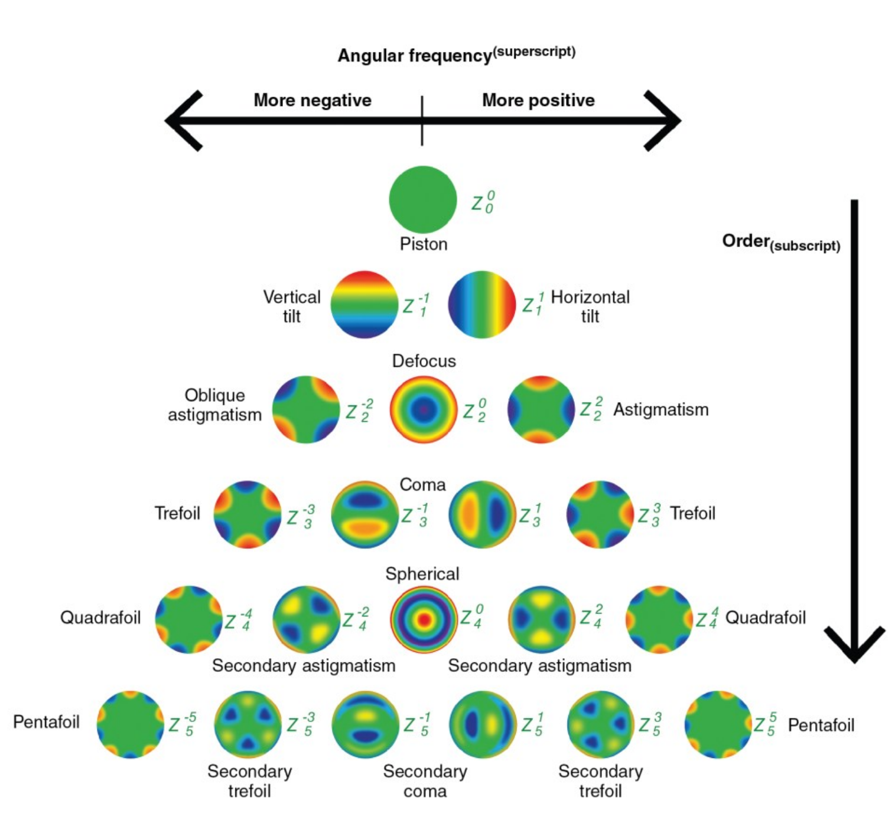

This implementation only supports the zernike based approach.
If only a specific subset of polynomials should be used for modeling they can be specified as as the zernike polynomials un the config.
Zernike polynomials are specified by thier order. So e.g. if you want only Astigmatism and Spherical aberration you would specify zernike_ploynomials:[[2,2],[0,4]]

